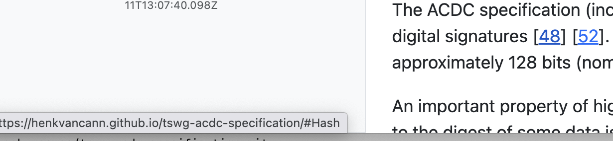

import CommandLineMenu from '../_shared-content/command-line-menu.md';

# Spec-Up-T Cheatsheet

Updated: 2025-09-28 20:55:20

:::info

Since “***Installation & Setup***” is used less often, this is listed [***below***](#installation--setup).

:::

## Set up your editing environment

We advice to keep a production version of your latest generated/rendered `index.html` file open, next to your IDE. This way you're able to:

1. Create/check internal cross-references: Find and copy the anchor to the found header in the browser, and paste it in the markdown via IDE.
2. Check where an existing link goes while hovering over the link.

### Example of copying anchors (1):

- use browser find-function (command-F) to find a block to cross-reference to
- use the `§` anchor link to copy the anchor URL
- paste and shorten the full URL to only the anchor.

NB 1. You can bypass this workflow, by predicting the way the markdown header will be transformed into an anchor and do all of this in the IDE. Safer is copy via the browser.

NB 2. If you change the header in markdown the link will be broken

### Example of hovering over links (2):

Go to a Spec-Up-T specification or glossary and hover over any link, the browser will show the URL (including an anchor if applicable). A visual check is now possible and also the link can be copied.



## TL;DR

1. `npx create-spec-up-t project-name`
2. Add terms in `spec/terms-definitions/*.md` with `[[def: term, alias]]` or `[[tref: term, alias]]` (external definition)
3. Reference with `[[ref: term]]` or `[[xref: spec, term]]`
4. `npm run menu` → Option 4 (Also runs Option 1)
5. Open `docs/index.html`

## Menu Options

Run `npm run menu` to access the interactive menu. You can also run these commands directly using `npm run <command>`.

| Option | Description                     | NPM Command                         |
| ------ | ------------------------------- | ----------------------------------- |
| [0]    | Add content                     | N/A                                 |
| [1]    | Render specification            | `npm run render`                    |
| [2]    | Export to PDF                   | `npm run topdf`                     |
| [3]    | Export to DOCX                  | `npm run todocx`                    |
| [4]    | Collect external references     | `npm run collectExternalReferences` |
| [5]    | Add, remove or view xref source | `npm run addremovexrefsource`       |
| [6]    | Configure                       | `npm run configure`                 |
| [7]    | Run health check                | `npm run healthCheck`               |
| [8]    | Open documentation website      | N/A                                 |
| [9]    | Freeze specification            | `npm run freeze`                    |
| [Q]    | Quit                            | N/A                                 |

## Reference Types

| Type       | Syntax                                 | Purpose                      | Output                  |
| ---------- | -------------------------------------- | ---------------------------- | ----------------------- |
| **`def`**  | `[[def:term,alias]]`                   | 🏷️ Define new term            | Creates anchor point    |
| **`ref`**  | `[[ref:term]]`                         | 🔗 Link to local term         | Clickable internal link |
| **`xref`** | `[[xref:spec,term]]`                   | 🌐 Link to external           | Opens external spec     |
| **`tref`** | `[[tref:spec,term,alias1,alias2,...]]` | 📥 Import external definition | Embeds full content     |
| **`spec`** | `[[spec:RFC-7519]]`                    | 📚 Cite specification         | Links to standard spec  |

:::info

The `,` (comma) is the delimiter. A space after a comma is okay, but not necessary.

:::

## Creating Definition Files

### 1. Create a new term file

```bash
# Navigate to terms directory
cd spec/terms-definitions/

# Create new definition file
touch my-new-term.md
```

:::info

File name should be descriptive but doesn't need to match the term

:::

### 2. Basic term file structure

```markdown
[[def: primary-term, synonym1, synonym2]]

~ This is the definition of the term using tilde prefix.

~ Additional paragraphs also use the tilde prefix.

~ Each paragraph represents a separate concept or detail.
```

Here follows a description of the structure of a term file:

| Markdown snippet                                            | Explanation                                                                                                             |
| ----------------------------------------------------------- | ----------------------------------------------------------------------------------------------------------------------- |
| `[[def: primary-term, synonym1, synonym2]]`                 | The definition should be the first line                                                                                 |
| `~ This is the definition of the term using tilde prefix.`  | Each new line should start with a `~` to indicate that it belongs to the definition (it becomes a `<dd>…</dd>` in HTML) |
| `~ Additional paragraphs also use the tilde prefix.`        | "                                                                                                                       |
| `~ Each paragraph represents a separate concept or detail.` | "                                                                                                                       |

:::info

`[[def: primary-term,synonym1,synonym2]]` without the spaces is also okay.

:::

**Key Points:**

- File name should be descriptive but doesn't need to match the term
- `[[def:]]` tag **must be the first line**
- Multiple synonyms are comma-separated
- Definition content uses `~` prefix for each paragraph

## Reference Syntax

- - -

### `anchor`

An `anchor` is a hyperlink that points to a specific location (or "anchor point") within the same webpage, typically identified by an element’s id attribute.

In Spec-Up-T headings and also terms get an id.

Creating a hyperlink within the same document is not a Spec-Up-T-specific action, but standard markdown language:

```md
[link](#heading-id)
```

Spec-Up-T will generate **heading** IDs for you, based on the heading text. For example, `### Hello World` will have ID `hello-world`.

So the rules are:
- spaces are replaced with dashes
- everything is converted to lowercase

In the case of **terms**, it is slightly more complicated. The best approach is to first generate the page once and then click on the symbol in front of a term to copy the ID to your clipboard.

```md
[Go to Hello World](#hello-world)
```
:::warning

Make sure that you do not create duplicate id's. If you do, the first one will be used by a browser.

:::

- - -

### `[[def: ...]]`

Local Term Definition example:

:::info

- - -

***[[def: authentication, auth, authn]]***

~ The process of verifying the identity of a user or system.

- - -

:::

```markdown
[[def: authentication, auth, authn]]

~ The process of verifying the identity of a user or system.
```

**Usage:** First line of term definition files only

- - -

### `[[ref: ...]]`

Internal Reference example:

:::info

- - -

[[def: access-control]]

~ Access control is a security technique that regulates who or what can view or use resources in a computing environment.

~ The system requires ***[[ref: authentication]]*** before access.

- - -

:::

```markdown
[[def: access-control]]

~ Access control is a security technique that regulates who or what can view or use resources in a computing environment.

~ The system requires [[ref: authentication]] before access.
```

**Usage:** Anywhere in the definition part of the content, to link to locally defined terms

- - -

### `[[xref: ...]]`

External Reference example:

:::info

- - -

[[def: verifiable-credential]]

~ A verifiable credential is a tamper-evident credential that has authorship that can be cryptographically verified.

~ See the ***[[xref: external-spec, credential]]*** specification for more details.

- - -

:::

```markdown
[[def: verifiable-credential]]

~ A verifiable credential is a tamper-evident credential that has authorship that can be cryptographically verified.

~ See the [[xref: external-spec, credential]] specification for more details.
```

**Usage:** Anywhere in the definition part of the content, to link to terms in other Spec-Up-T repositories

- - -

### `[[tref: ...]]`

Transcluded Reference example:

:::info
- - -
***[[tref: external-spec, digital-signature, alias]]***

&lt;external definition that will be included&gt;

Optional: your own text.
- - -
:::

```markdown
[[tref: external-spec, digital-signature]]
[[tref: external-spec, digital-signature, alias]]
[[tref: external-spec, digital-signature, alias1, alias2]]

Optional: your own text.
```

**Usage:** First line of term definition files only. Embeds complete external definition. Supports multiple aliases (comma-separated). File can contain only this tag, but optionally you can add text in your local file, that will be added below the external, embedded definition.

- - -

### `[[spec: ...]]`

Specification Reference example:

:::info

- - -

According to ***[[spec: RFC-7519]]***, JSON Web Tokens are...

- - -

:::

```markdown
According to [[spec: RFC-7519]], JSON Web Tokens are...
```

**Usage:** Reference standard specifications <del>(from specref.org database)</del> currently under development.

## Rendering & Menu Navigation

### Launch Menu

```bash
npm run menu
```

**Menu Options:**

<CommandLineMenu />

### `[0]`: Add content

**What it does:**

- Shows a short instruction on how to add content
- Shows a link to the this website (the website you are currently reading)

### `[1]`: Render Specification

**What it does:**

- Processes all markdown files
- Resolves term references
- Generates `docs/index.html`
- Creates complete specification
- Opening in a browser via local file system (`file:///`) will work for almost everything (simply put: double click on the file in “Finder” or “Explorer”)

### `[2]`: Export to PDF

**What it does:**

- Exports the specification to PDF format
- Creates a `.pdf` file

### `[3]`: Export to DOCX

**What it does:**

- Exports the specification to Microsoft Word format
- Creates a `.docx` file

### `[4]`: Collect External References

**What it does:**

- Fetches definitions from external repositories
- Updates local cache with latest versions
- Also runs option 1

**When to use:**

- After adding new external specifications

### `[5]`: Add/remove xref source

**What it does:**

- Allows you to add or remove external specification sources
- Manages the list of repositories that can be referenced with `[[xref: ...]]` and `[[tref: ...]]`

### `[6]`: Configure

**What it does:**

- Opens configuration options for the Spec-Up-T project
- Allows you to modify settings in `specs.json`

### `[7]`: Run Health Check

**What it does:**

- Provides diagnostic information

### `[8]`: Open Documentation Website

**Alternative:** Opens `https://blockchainbird.github.io/spec-up-t-website/`

### `[9]`: Freeze Specification

**What it does:**

- Creates a snapshot of your current specification

### `[Q]`: Quit

**What it does:**

- Quits the menu

## Installation & Setup

```bash
# Create new Spec-Up-T project
npx create-spec-up-t my-spec-project
cd my-spec-project

# npm install will run automatically

# Launch interactive menu
npm run menu
```

## Clone Existing Repository

```bash
# Clone existing Spec-Up-T repository
git clone https://github.com/username/repository-name.git
cd repository-name

# Check out correct branch (if needed)
git checkout branch-name

# Install dependencies
npm install

# Launch interactive menu
npm run menu
```

**Key Steps:**

1. **Get repository URL** from GitHub (green "Code" button)
2. **Clone** with `git clone <url>`
3. **Navigate** into cloned directory
4. **Install dependencies** with `npm install`
5. **Run menu** to start working

**Remote Setup (Recommended):**

```bash
# Add upstream remote for original repo
git remote add upstream https://github.com/original/repo.git

# Set origin to your fork
git remote set-url origin https://github.com/yourusername/repo.git
```

## Project Structure

`docs/`: output files
`spec/`: input files

```text
my-spec-project/
├── .cache/                  # 📝 Can be removed at all times
├── docs/
│   ├── versions/            # 📝 Versioned files
│   │   ├── v1
│   │   └── v2
│   ├── index.html           # 📄 The final specification file
│
├── spec/
│   ├── terms-definitions/   # 📝 Individual term files
│   │   ├── term-1.md
│   │   └── term-2.md
│   ├── spec-head.md         # 📄 Main content files
│   └── spec-body.md
└── specs.json               # ⚙️  Configuration
```

## Configuration Example

**specs.json:** [Go to `specs.json` (raw file in the Spec-Up-T repo boilerplate code)](https://raw.githubusercontent.com/blockchainbird/spec-up-t/refs/heads/master/src/install-from-boilerplate/boilerplate/specs.json)

## Embedding GitHub-Hosted Images

GitHub URLs to images don't point directly to raw files. Get the raw URL using one of these methods:

### Method 1: Copy Image Address

1. Navigate to image in GitHub → Click **Download**
2. Right-click image → **Copy Image Address**

Result: `https://raw.githubusercontent.com/org/repo/main/images/file.png`

### Method 2: Copy Download Link

1. Navigate to image in GitHub
2. Right-click **Download** button → **Copy Link**

Result: `https://github.com/org/repo/raw/main/images/file.png`

### Method 3: Append Raw Parameter

Add `?raw=true` to any GitHub file URL:

```text
https://github.com/org/repo/blob/main/images/file.png?raw=true
```

:::tip

Method 3 is fastest when converting existing URLs—just append `?raw=true`

:::

## Common Patterns & Tips

### ❌ DON'T

- … put content before `[[def:]]` or `[[tref:]]` tag in term files
- … forget the `~` prefix for definition content
- … skip re-running menu option 4 when using new `xref`/`tref`
- … use GitHub HTML page URLs for images (must use raw URLs)
