# 🚀 Spec-Up-T Cheatsheet

## 📦 Installation & Setup

```bash
# Create new Spec-Up-T project
npx create-spec-up-t my-spec-project
cd my-spec-project

# Install dependencies (if needed)
npm install

# Launch interactive menu
npm run menu
```

**Project Structure:**

```text
my-spec-project/
├── spec/
│   ├── terms-definitions/     # 📝 Individual term files
│   │   ├── term-1.md
│   │   └── term-2.md
│   ├── spec-head.md          # 📄 Main content files
│   └── spec-body.md
├── specs.json               # ⚙️  Configuration
└── package.json            # 📦 Dependencies & scripts
```

---

## 📄 Creating Definition Files

### 1. Create a new term file

```bash
# Navigate to terms directory
cd spec/terms-definitions/

# Create new definition file
touch my-new-term.md
```

### 2. Term file structure

```markdown
[[def: primary-term, synonym1, synonym2]]

~ This is the definition of the term using tilde prefix.

~ Additional paragraphs also use the tilde prefix.

~ Each paragraph represents a separate concept or detail.
```

**💡 Key Points:**

- File name should be descriptive but doesn't need to match the term
- `[[def:]]` tag **must be the first line**
- Multiple synonyms are comma-separated
- Definition content uses `~` prefix for each paragraph

---

## 🔗 Reference Syntax Quick Guide

### Local Term Definition: `[[def: ...]]`

```markdown
[[def: authentication, auth, authn]]

~ The process of verifying the identity of a user or system.
```

**📍 Usage:** First line of term definition files only

### Internal Reference: `[[ref: ...]]`

```markdown
The system requires [[ref: authentication]] before access.
```

**📍 Usage:** Anywhere in content to link to locally defined terms

### External Reference: `[[xref: ...]]`

```markdown
See the [[xref: external-spec, credential]] specification.
```

**📍 Usage:** Link to terms in other Spec-Up-T repositories

### Transcluded Reference: `[[tref: ...]]`

```markdown
[[tref: external-spec, digital-signature]]
```

**📍 Usage:** Embeds complete external definition (file can contain only this tag, but optionally you can add text in your local file, that will be added below the external, embedded definition)

### Specification Reference: `[[spec: ...]]`

```markdown
According to [[spec: RFC-7519]], JSON Web Tokens are...
```

**📍 Usage:** Reference standard specifications (from specref.org database)

---

## 🎯 Visual Reference Types Comparison

| Type | Syntax | Purpose | Output |
|------|--------|---------|---------|
| **`def`** | `[[def:term,alias]]` | 🏷️ Define new term | Creates anchor point |
| **`ref`** | `[[ref:term]]` | 🔗 Link to local term | Clickable internal link |
| **`xref`** | `[[xref:spec,term]]` | 🌐 Link to external | Opens external spec |
| **`tref`** | `[[tref:spec,term]]` | 📥 Import external definition | Embeds full content |
| **`spec`** | `[[spec:RFC-7519]]` | 📚 Cite specification | Links to standard spec |

---

## ⚡ Rendering & Menu Navigation

### Launch Menu

```bash
npm run menu
```

**Menu Options:**

```text
  ┌─────────────────────────────────────┐
  │  [0] Add content                    │
  │  [1] Render specification  ⭐       │
  │  [2] Export to PDF                  │
  │  [3] Collect external refs (cache)  │
  │  [4] Collect external refs (fresh)  │
  │  [5] Add/remove xref source         │
  │  [6] Configure                      │
  │  [7] Open documentation             │
  │  [8] Freeze specification           │
  │  [Q] Quit                           │
  └─────────────────────────────────────┘
```

### Option 1: Render Specification 🎯

**What it does:**

- Processes all markdown files
- Resolves term references
- Generates `docs/index.html`
- Creates complete specification

**Alternative commands:**

```bash
npm run render          # One-time render
npm run edit           # Render + watch for changes
npm run dev            # Debug mode
```

### Option 4: Collect External References 🔄

**What it does:**

- Fetches definitions from external repositories
- Updates local cache with latest versions
- Required before using `xref` or `tref` tags

**When to use:**

- After adding new external specifications
- When external specs have been updated
- Before rendering if external references fail

---

## 🔧 Configuration Example

**specs.json:**

```json
{
  "specs": [{
    "title": "My Specification",
    "spec_directory": "./spec",
    "spec_terms_directory": "terms-definitions",
    "output_path": "./docs",
    "external_specs": [
      {
        "external_spec": "toip-glossary",
        "url": "https://github.com/trustoverip/glossary",
        "gh_page": "https://trustoverip.github.io/glossary/",
        "terms_dir": "spec/terms-definitions"
      }
    ]
  }]
}
```

---

## 🚨 Common Patterns & Tips

### ✅ DO

- Keep term files focused on single concepts
- Use meaningful synonyms in `[[def:]]` tags
- Test references with Option 1 (render) frequently
- Collect external references (Option 4) before rendering

### ❌ DON'T

- Put content before `[[def:]]` tag in term files
- Forget the `~` prefix for definition content
- Use `[[tref:]]` with additional content in same file
- Skip external reference collection when using `xref`/`tref`

### 🔍 Debugging

```bash
# Check for broken references
npm run render

# View generated files
open docs/index.html

# Check external reference cache
ls -la .cache/
```

---

## 🎨 Visual Workflow

```mermaid
graph TD
    A["📁 Create Project<br/>npx create-spec-up-t"] --> B["📝 Write Content<br/>spec/*.md files"]
    B --> C["🏷️ Define Terms<br/>def: term, alias"]
    C --> D["🔗 Add References<br/>ref: term"]
    D --> E["🌐 Configure External<br/>specs.json"]
    E --> F["📡 Collect External<br/>Menu Option 4"]
    F --> G["🎯 Render Spec<br/>Menu Option 1"]
    G --> H["🌟 View Result<br/>docs/index.html"]
    
    style A fill:#e1f5fe
    style G fill:#c8e6c9
    style H fill:#fff3e0
```



---

**🎯 TL;DR for Busy Devs:**

1. `npx create-spec-up-t project-name`
2. Add terms in `spec/terms-definitions/*.md` with `[[def: term]]`
3. Reference with `[[ref: term]]` or `[[xref: spec, term]]`
4. `npm run menu` → Option 4 → Option 1
5. Open `docs/index.html`

**Need help?** Check the full documentation or use `npm run menu` → Option 7
