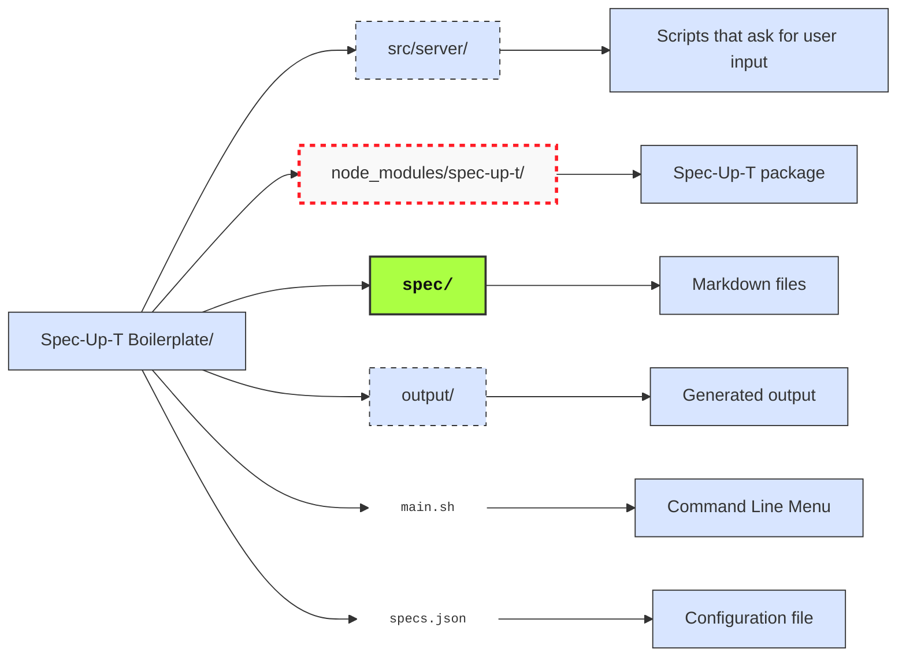
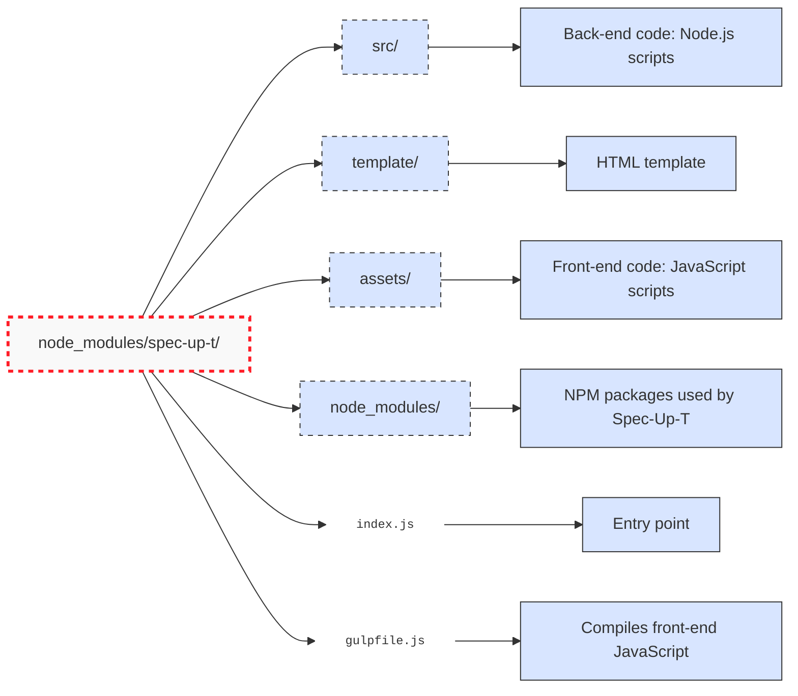
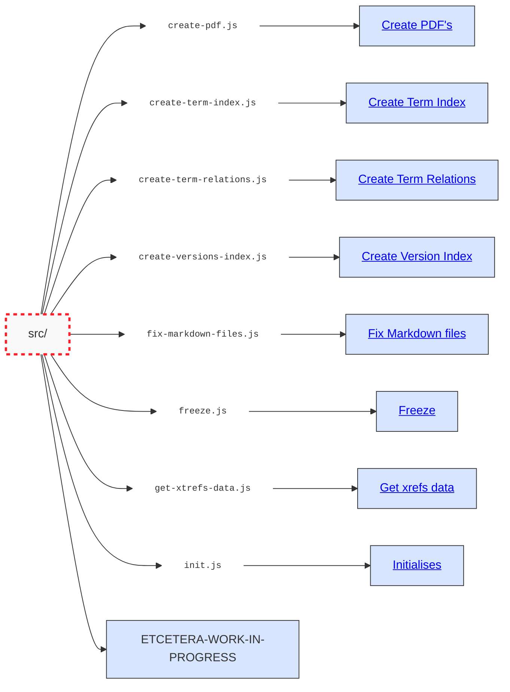

# Schema

## Boilerplate

The boilerplate is the starting point of the Spec-Up-T system. This is the go to directory.

## Spec-Up-T package

These are the main files and directories of the spec-up-t package, necessary for understanding how it works.

## Spec-Up-T `src`

## Files description

### create-pdf.js

Creates pdf's.

### create-term-index.js

Creates term index.

### create-term-relations.js

Creates term relations.

### create-versions-index.js

Creates version index

### fix-markdown-files.js

Fixes markdown files

### freeze.js

Fixes markdown files

### get-xtrefs-data.js

Get xtref data

### init.js

Initialise.

