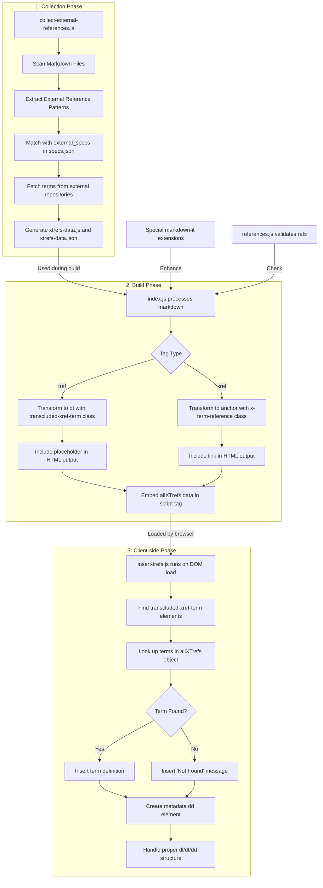

# External References

This document explains how external references work in Spec-Up-T, covering both xref (external reference links) and tref (transcluded references).

## Syntax and Usage

### External References (xref)

The xref tag creates a hyperlink to a term defined in another specification:

```markdown
[[xref:external-spec,term]]
```

Example:

```markdown
As described in the [[xref:kmg-1,authentic-chained-data-container]] specification...
```

### Transcluded References (tref)

The `tref` tag embeds a term and its definition from another specification directly into your document:

```markdown
[[tref:external-spec,term]]
```

Example:

```markdown
[[tref:kmg-1,authentic-chained-data-container]]
```

How External References Work

External references are processed in three phases:

1. Collection Phase

During the build preparation:

- `collect-external-references.js` scans all markdown files
- It extracts all external reference patterns
- Each reference is matched with external specifications defined in `specs.json`
- “external specifications” are Spec-Up-T specifications (external repositories) elsewhere on GitHub
- The system fetches terms and definitions from external repositories
- The collected data is saved to `xtrefs-data.js` and `xtrefs-data.json`

2. Build Phase

When generating HTML:

- `index.js` processes the markdown containing reference tags
- `xref` tags are transformed into anchor elements with class `x-term-reference`
- `tref` tags are transformed into `dt` elements with class `transcluded-xref-term`
- The `allXTrefs` data object is embedded in a script tag in the output HTML

3. Client-side Phase

In the browser:

- `insert-trefs.js` runs when the DOM is loaded
- It finds all elements with the `transcluded-xref-term` class
- For each term, it looks up the definition in the `allXTrefs` object
- It inserts the term definition and metadata about its source
- Special handling ensures proper `dl/dt/dd` structure in the HTML

## Reference Processing Flow


## Implementation Details

Data Structure

The `allXTrefs` object contains structured data about external references:

```js
const allXTrefs = {
  "xtrefs": [
    {
      "externalSpec": "toip1",
      "term": "SSI",
      "repoUrl": "https://github.com/example/repo",
      "terms_dir": "spec/terms-definitions",
      "owner": "example-owner",
      "repo": "example-repo",
      "site": null,
      "commitHash": "1a2b3c4d5e6f",
      "content": "[[def: SSI, self-sovereign identity]]\n\nA term for an identity system..."
    },
    // More terms...
  ]
};
```

### Reference Validation

The system validates references during build:

- Unresolved references (terms referenced but not defined) are logged
- Dangling definitions (terms defined but not referenced) are logged

### HTML Structure

For transcluded terms, the system generates:

- A definition term (`dt`) with the original term text
- A definition description (`dd`) with the full content
- A metadata section showing repository, owner, and commit information

## Best Practices

1. Ensure External Specs are Configured: All referenced repositories must be defined in specs.json
2. Use Consistent Term Names: Match the exact term name as defined in the source repository
3. Check Build Logs: Review for any unresolved references or errors
4. Consider Versioning: External references point to specific commits to ensure stability

## Configuration Example

In `specs.json`:

```json
{
  "specs": [
    {
      "title": "My Specification",
      "external_specs": [
        {
          "external_spec": "kmg-1",
          "path": "https://github.com/org/repo",
          "terms_dir": "spec/terms-definitions",
          "gh_page": "https://org.github.io/repo"
        }
      ]
    }
  ]
}
```


