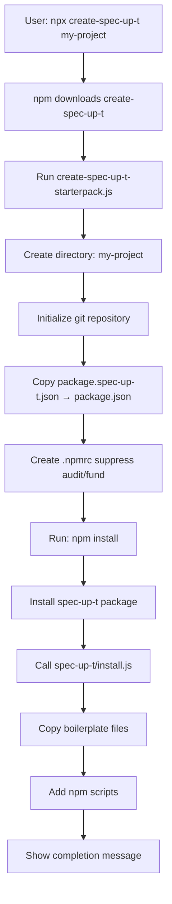

# Starter Pack Architecture

This document explains how the `create-spec-up-t` package works, its relationship with the main `spec-up-t` package, and how to maintain it.

## Overview

The `spec-up-t-starter-pack` repository (published as `create-spec-up-t` on npm) is an **initializer package** that sets up new Spec-Up-T projects. It follows the same pattern as popular tools like `create-react-app` and `create-next-app`.

Users run:
```bash
npx create-spec-up-t my-new-spec
```

This creates a new directory with a complete Spec-Up-T project ready to use.

## Package Naming

| Repository Name | npm Package Name | Purpose |
|----------------|------------------|---------|
| `spec-up-t-starter-pack` | `create-spec-up-t` | Follows npm convention for initializers |

The `create-` prefix is an npm convention that allows users to run `npx create-spec-up-t` without needing to know the full repository name.

## Two-Package System

The starter pack uses **two `package.json` files** within the repository:

### 1. `package.json` - The Installer Package

```json
{
  "name": "create-spec-up-t",
  "version": "2.0.3",
  "bin": {
    "create-spec-up-t": "create-spec-up-t-starterpack.js"
  },
  "dependencies": {
    "fs-extra": "^11.2.0"
  }
}
```

This is the package that gets published to npm and downloaded when users run `npx create-spec-up-t`.

### 2. `package.spec-up-t.json` - The Target Project Template

```json
{
  "name": "spec-up-t-starterpack",
  "version": "2.0.3",
  "dependencies": {
    "dotenv": "^16.4.5",
    "spec-up-t": "^1.6.0"
  }
}
```

This file becomes the `package.json` of the newly created project.

## Installation Flow



### Step-by-Step Process

1. **User executes**: `npx create-spec-up-t my-new-spec`

2. **npm downloads** the `create-spec-up-t` package

3. **create-spec-up-t-starterpack.js runs**:
   - Creates the target directory
   - Initializes a git repository
   - Copies `package.spec-up-t.json` → `package.json` in the new directory
   - Creates `.npmrc` to suppress npm audit/fund messages
   - Runs `npm install --silent`

4. **spec-up-t package is installed**, then the installer script explicitly calls:
   ```javascript
   require(path.join(packagePath, 'src', 'install-from-boilerplate', 'install.js'));
   ```

5. **spec-up-t installation script executes**:
   - Copies boilerplate files from `spec-up-t/src/install-from-boilerplate/boilerplate/`
   - Adds npm script entries to the project's `package.json`
   - Shows completion message

## Relationship with spec-up-t Package

The starter pack is a **thin wrapper** that delegates most functionality to the `spec-up-t` package:

### What spec-up-t Provides

1. **Boilerplate files**: All template files stored in:
   ```
   spec-up-t/src/install-from-boilerplate/boilerplate/
   ```

2. **Installation logic**: File copying and package.json modification:
   ```
   spec-up-t/src/install-from-boilerplate/install.js
   spec-up-t/src/install-from-boilerplate/copy-boilerplate.js
   spec-up-t/src/install-from-boilerplate/add-scripts-keys.js
   ```

3. **The tool itself**: The installed project uses spec-up-t as a dependency

### Advantages of This Architecture

- ✅ **Single source of truth**: Boilerplate maintained in one place
- ✅ **Automatic updates**: New boilerplate features available to new projects
- ✅ **Lightweight starter**: The starter pack stays small
- ✅ **Separation of concerns**: Clear responsibility boundaries

## Version Numbering Strategy

### Recommended Approach: Synchronized Versions

Keep both `package.json` and `package.spec-up-t.json` at the **same version number**.

## How to Update the Starter Pack

### When to Update

Update when:
- The `spec-up-t` package has a new version with important features/fixes
- Boilerplate files in `spec-up-t` have changed
- You want to change default dependencies of new projects

### Update Process

#### Step 1: Update the spec-up-t dependency

Edit `package.spec-up-t.json`:
```json
{
  "dependencies": {
    "spec-up-t": "^1.6.0"  // ← Update to latest
  }
}
```

#### Step 2: Bump both versions (synchronized)

Update **both** files to the same version:

**In `package.json`:**

```json
{
  "version": "2.0.3"
}
```

**In `package.spec-up-t.json`:**

```json
{
  "version": "2.0.3"
}
```

#### Step 3: Test locally

```bash
cd /path/to/spec-up-t-starter-pack

# Test installation
node create-spec-up-t-starterpack.js test-project

# Or use npx
npx . test-project

# Verify
cd test-project
npm run render

# Clean up
cd ..
rm -rf test-project
```

#### Step 4: Commit and push

See [Publishing to GitHub and npm](./publishing-to-github-and-npm.md).

#### Step 5: Test the published version

```bash
npx create-spec-up-t@latest test-published
cd test-published
npm run render
```

## Testing Checklist

Before publishing:

- [ ] Test local installation
- [ ] Verify target spec-up-t version exists on npm
- [ ] Check all boilerplate files copied correctly
- [ ] Test npm scripts work (`npm run render`, `npm run dev`)
- [ ] Verify `specs.json` is valid
- [ ] Test interactive menu (`npm run edit`)
- [ ] Clean up test directories

## Known Considerations

### Project Name is Fixed

The installed project always gets:
```json
{
  "name": "spec-up-t-starterpack"
}
```

Users should manually update this to their actual project name after installation.

### Two Packages Must Be Published

When boilerplate changes are made:
1. Publish new version of `spec-up-t`
2. Update dependency and publish new version of `create-spec-up-t`

This ensures users always get the latest boilerplate when creating new projects.

## Repository Files

| File | Purpose | Required |
|------|---------|----------|
| `package.json` | npm installer package definition | ✅ Yes |
| `package.spec-up-t.json` | Template for new projects | ✅ Yes |
| `create-spec-up-t-starterpack.js` | Main installation script | ✅ Yes |
| `messages.js` | User-facing messages | ✅ Yes |
| `start.js` | GitHub Actions wrapper | ✅ For CI/CD |
| `action.yml` | GitHub Actions configuration | ✅ For CI/CD |

## Related Documentation

- [Publishing to GitHub and npm](./publishing-to-github-and-npm.md)
- [GitHub Repositories Overview](./github-repositories.md)
- [Testing Guide](./testing-guide.md)
