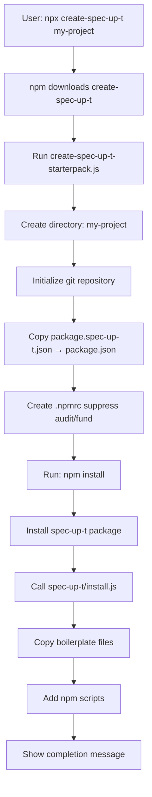

# Starter Pack Architecture

This document explains how the `create-spec-up-t` package works, its relationship with the main `spec-up-t` package, and how to maintain it.

## Overview

The `spec-up-t-starter-pack` repository (published as `create-spec-up-t` on npm) is an **initializer package** that sets up new Spec-Up-T projects. It follows the same pattern as popular tools like `create-react-app` and `create-next-app`.

Users run:
```bash
npx create-spec-up-t my-new-spec
```

This creates a new directory with a complete Spec-Up-T project ready to use.

## Package Naming

| Repository Name | npm Package Name | Purpose |
|----------------|------------------|---------|
| `spec-up-t-starter-pack` | `create-spec-up-t` | Follows npm convention for initializers |

The `create-` prefix is an npm convention that allows users to run `npx create-spec-up-t` without needing to know the full repository name.

## Two-Package System

The starter pack uses **two `package.json` files** within the repository:

### 1. `package.json` - The Installer Package

```json
{
  "name": "create-spec-up-t",
  "version": "2.2.0",
  "bin": {
    "create-spec-up-t": "create-spec-up-t-starterpack.js"
  },
  "dependencies": {
    "fs-extra": "^11.2.0"
  }
}
```

This is the package that gets published to npm and downloaded when users run `npx create-spec-up-t`.

### 2. `package.spec-up-t.json` - The Target Project Template

```json
{
  "name": "spec-up-t-starterpack",
  "version": "2.2.0",
  "dependencies": {
    "dotenv": "^16.4.5",
    "spec-up-t": "2.1.0"
  }
}
```

This file becomes the `package.json` of the newly created project.

- `"version"` is the **starter pack** (`create-spec-up-t`). That is currently `2.2.0`.
- `"spec-up-t"` is the **tool** `npm install` will fetch. After you publish `spec-up-t` 2.1.0, set this pin to `"2.1.0"` (today it is still `"2.0.0"`).

Those two numbers are independent. The starter pack can be `2.2.0` or `2.3.0` while the tool pin is `2.1.0`. `custom-update` on existing repos does not read this file.

## Installation Flow


```mermaid
graph TD
    A[User: npx create-spec-up-t my-project] --> B[npm downloads create-spec-up-t]
    B --> C[Run create-spec-up-t-starterpack.js]
    C --> D[Create directory: my-project]
    D --> E[Initialize git repository]
    E --> F[Copy package.spec-up-t.json → package.json]
    F --> G[Create .npmrc suppress audit/fund]
    G --> H[Run: npm install]
    H --> I[Install spec-up-t package]
    I --> J[Call spec-up-t/install.js]
    J --> K[Copy boilerplate files]
    K --> L[Add npm scripts]
    L --> M[Show completion message]
```

### Step-by-Step Process

1. **User executes**: `npx create-spec-up-t my-new-spec`

2. **npm downloads** the `create-spec-up-t` package

3. **create-spec-up-t-starterpack.js runs**:
   - Creates the target directory
   - Initializes a git repository
   - Copies `package.spec-up-t.json` → `package.json` in the new directory
   - Creates `.npmrc` to suppress npm audit/fund messages
   - Runs `npm install --silent`

4. **spec-up-t package is installed**, then the installer script explicitly calls:
   ```javascript
   require(path.join(packagePath, 'src', 'install-from-boilerplate', 'install.js'));
   ```

5. **spec-up-t installation script executes**:
   - Copies boilerplate files from `spec-up-t/src/install-from-boilerplate/boilerplate/`
   - Adds npm script entries to the project's `package.json`
   - Shows completion message

## Relationship with spec-up-t Package

The starter pack is a **thin wrapper** that delegates most functionality to the `spec-up-t` package:

### What spec-up-t Provides

1. **Boilerplate files**: All template files stored in:
   ```
   spec-up-t/src/install-from-boilerplate/boilerplate/
   ```

2. **Installation logic**: File copying and package.json modification:
   ```
   spec-up-t/src/install-from-boilerplate/install.js
   spec-up-t/src/install-from-boilerplate/copy-boilerplate.js
   spec-up-t/src/install-from-boilerplate/add-scripts-keys.js
   ```

3. **The tool itself**: The installed project uses spec-up-t as a dependency

## Pin `spec-up-t` for new projects

`npx create-spec-up-t` copies `package.spec-up-t.json` to the new repo as `package.json`. New projects therefore install **exactly** the `spec-up-t` version listed there.

After `spec-up-t` **2.1.0** is on npm, that pin must be:

```json
"spec-up-t": "2.1.0"
```

Then publish a new `create-spec-up-t`. Until you do, `npx create-spec-up-t` keeps creating projects on the previous pin (currently 2.0.0).

Do the same for every later `spec-up-t` release that new projects should start on (`2.1.1`, `2.2.0`, and so on):

1. Publish `spec-up-t` first. The pin must name a version that already exists on npm.
2. Set `"spec-up-t"` in `package.spec-up-t.json` to that version.
3. Bump and publish `create-spec-up-t`.

The starter-pack version (`create-spec-up-t`) does not have to match the `spec-up-t` version. Keep `package.json` and `package.spec-up-t.json` at the **same starter-pack version**. Only the `dependencies.spec-up-t` field tracks the tool.

Existing repos do not pick up this pin. They update with [custom-update](../maintenance-tasks/custom-update.md).

## Version Numbering Strategy

### Recommended Approach: Synchronized Versions

Keep both `package.json` and `package.spec-up-t.json` at the **same starter-pack version number**. The `spec-up-t` dependency inside `package.spec-up-t.json` is a separate pin, described above.

## How to Update the Starter Pack

### Which package do you actually publish?

`npx create-spec-up-t` downloads **`create-spec-up-t`**, not `spec-up-t`.

| You changed… | Publish |
|--------------|---------|
| Starter-pack installer, messages, or `package.spec-up-t.json` (for example pinning a newer already-published `spec-up-t`) | **Only** `create-spec-up-t` |
| Boilerplate or install logic inside the `spec-up-t` repo | Publish **`spec-up-t` first**, then pin that version in `package.spec-up-t.json`, then publish `create-spec-up-t` |

You do **not** need a new `spec-up-t` release just because you bumped the starter-pack version. New projects already install whatever `spec-up-t` version is listed in `package.spec-up-t.json`. If that version is already on npm, skip publishing `spec-up-t`.

You **do** need to bump **`package.json`** (not only `package.spec-up-t.json`). npm publishes `create-spec-up-t` from `package.json`. A version that already exists on npm cannot be published again.

### When to Update

Update the starter pack when:
- A new `spec-up-t` version is already on npm and new projects should use it
- You changed the installer (`create-spec-up-t-starterpack.js`, `messages.js`)
- You want to change default dependencies of new projects

### Update and publish `create-spec-up-t`

Do these steps in order. Do **not** use `npm version`: that command only updates `package.json` and `package-lock.json`, and would leave `package.spec-up-t.json` behind. Edit the two JSON files, let `npm install` update the lockfile, then commit, tag, push, and publish.

Default branch is `main`. `create-spec-up-t` is currently `2.2.0`, so the next starter-pack publish is a new unused version (for example `2.3.0`). That is not the same number as the `spec-up-t` pin.

#### Step 1: Edit the two JSON files, then refresh the lockfile

In **both** `package.json` and `package.spec-up-t.json`, set the same **starter-pack** version (next unused `create-spec-up-t` version, for example `2.3.0`):

```json
"version": "2.3.0"
```

In `package.spec-up-t.json`, also set the `spec-up-t` dependency to the tool version new projects should install. After `spec-up-t` 2.1.0 is on npm, that is `"2.1.0"`. For a later tool release, set that later version. It must already exist on npm:

```json
"spec-up-t": "2.1.0"
```

Then, in the starter-pack repo, run:

```bash
npm install
```

`npm install` rewrites the `create-spec-up-t` version in `package-lock.json`. Do not edit that file by hand. It does not list `spec-up-t`; the new project installs `spec-up-t` later from `package.spec-up-t.json`.

#### Step 2: Test locally (optional but recommended)

```bash
cd /path/to/spec-up-t-starter-pack
node create-spec-up-t-starterpack.js test-project
cd test-project
npm run render
cd ..
rm -rf test-project
```

#### Step 3: Commit, tag, push to GitHub, publish to npm

```bash
cd /path/to/spec-up-t-starter-pack
git checkout main

npm whoami
# Must print your npm username. If it errors, run: npm login

git add package.json package.spec-up-t.json package-lock.json
git commit -m "Bump version to 2.3.0"
git tag v2.3.0
git push origin main --tags
npm publish
```

`npm publish` publishes **`create-spec-up-t@2.3.0`**. It does not publish `spec-up-t`. The new projects it creates will install whatever `"spec-up-t"` is pinned in `package.spec-up-t.json` (for this release, `2.1.0`).

#### Step 4: Check that npm has the new version

```bash
npm view create-spec-up-t version
npx create-spec-up-t@latest test-published
```

## Testing Checklist

Before publishing:

- [ ] Test local installation
- [ ] Verify target spec-up-t version exists on npm
- [ ] Check all boilerplate files copied correctly
- [ ] Test npm scripts work (`npm run render`, `npm run dev`)
- [ ] Verify `specs.json` is valid
- [ ] Test interactive menu (`npm run edit`)
- [ ] Clean up test directories

## Known Considerations

### Project Name is Fixed

The installed project always gets:
```json
{
  "name": "spec-up-t-starterpack"
}
```

Users should manually update this to their actual project name after installation.

### When boilerplate in spec-up-t changes

Boilerplate files live in `spec-up-t`, not in this repo. `create-spec-up-t` copies them by installing the `spec-up-t` version pinned in `package.spec-up-t.json` and then running that package’s `install.js`.

If you changed boilerplate or install logic in **`spec-up-t`**:

1. Publish a new `spec-up-t` version first (see [Publishing to GitHub and npm](./publishing-to-github-and-npm.md)).
2. Set that version in `package.spec-up-t.json`.
3. Publish a new `create-spec-up-t` version using the steps above.

If you did **not** change `spec-up-t`, skip steps 1–2 and publish only `create-spec-up-t`.

## Repository Files

| File | Purpose | Required |
|------|---------|----------|
| `package.json` | npm installer package definition | ✅ Yes |
| `package.spec-up-t.json` | Template for new projects | ✅ Yes |
| `create-spec-up-t-starterpack.js` | Main installation script | ✅ Yes |
| `messages.js` | User-facing messages | ✅ Yes |
| `start.js` | GitHub Actions wrapper | ✅ For CI/CD |
| `action.yml` | GitHub Actions configuration | ✅ For CI/CD |

## Related Documentation

- [Publishing to GitHub and npm](./publishing-to-github-and-npm.md)
- [GitHub Repositories Overview](./github-repositories.md)
- [Testing Guide](./testing-guide.md)
