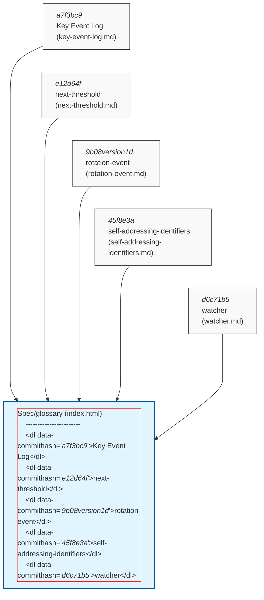
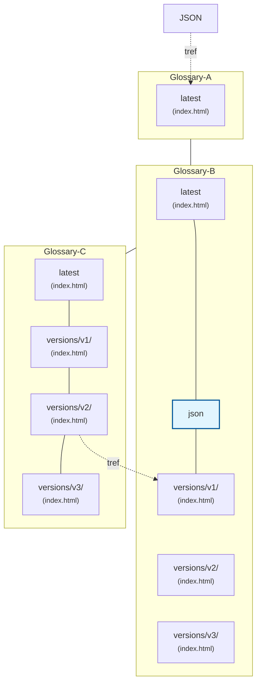

# Web of Repo's

:::warning
Work in progress.
:::

Here is a description of the proposed future way of referencing external repositories, with the goal of creating a consistent system.

## Repository Flow Diagram

A glossary / specification is captured in an index.html file. Input for this file is code for styling and behaviour and the actual text.

This text is imported from markdown files. The markdown files are stitched together in a specific order. The markdown files that contain the terms are in a dedicated sub directory.

## Relation between the markdown files and the index.html file

## Relation between glossaries

