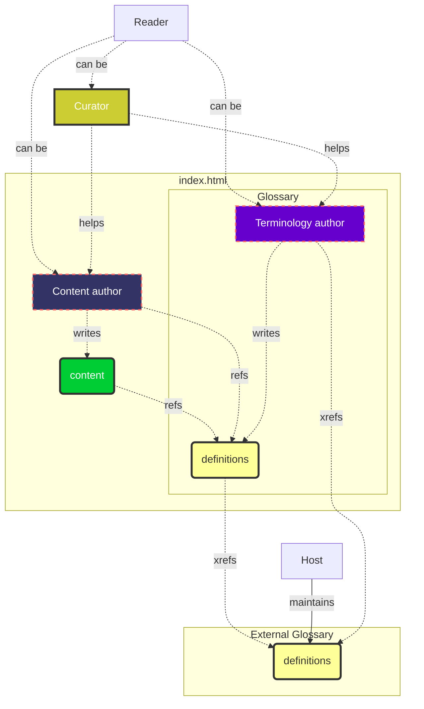

# Introduction

## Intro

**Spec-Up-T** is a tool that helps you write specifications. Specifications in Spec-Up-T have two main parts:
* content 
* term definitions

Content is stored in markdown files under the `spec` directory, Terms definition optionally in various languages and optionally in various user levels are stored in the `terms-definitions` folder also in the spec directory.

The two parts content and term definitions also illustrate the two main use cases of Spec-Up-T both resulting in single-file html servable from any webserver:
- a glossary (fat terms section, slim content section)
- a standardization specification (slim terms section, fat content section)

> An example **glossary** is the [Main TrustoverIP glossary](https://github.com/trustoverip/ctwg-main-glossary)
> An example **standard specification** is the [DID:Webs specification](https://github.com/trustoverip/tswg-did-method-webs-specification)

## Use cases and roles in Spec-Up-T

Spec-Up-T is a technical specification and standardization tool, which a special focus on termninology: definiton and (externally) referencing terms and the version management of this complex.

We have distinguished the following **roles**:
- [terminology-authors](./various-roles/terminology-authors-guide/introduction.md)
- [content-authors](./various-roles/content-authors-guide/introduction.md)
- [curators](./various-roles/curators-guide/introduction.md)
- [readers](./various-roles/readers-guide/introduction.md)

Supporting roles are:
- [admins](./various-roles/admins-guide/introduction.md)
- [developers](./various-roles/developers-guide.md)

All the **use cases** are specified under the roles above. Click the links to get there.

## Technical presence

It is a tool for writing in Markdown and creates *one* `index.html` file.

- You write your texts in [Markdown](https://www.markdownguide.org/getting-started/)
- You use an editor (IDE) or you use GitHub's web editor
- Your Markdown-files are converted to one `index.html` file
- The place where your Markdown files and the `index.html` are stored is [GitHub](https://github.com)

The endproduct of your work is **the `index.html` file, the actual specification file.**

This `index.html` file is stand-alone and can be hosted on any web server. Or double-click it, and it will open in a browser.

The Spec-Up-T code itself is available [on Github](https://github.com/blockchainbird/spec-up-t).

## Spec-Up and Spec-Up-T

Spec-Up-T is based on **Spec-Up**, and some of the content on this website is taken from the [Spec-Up website](https://identity.foundation/spec-up/) and [repo](https://github.com/decentralized-identity/spec-up).

:::tip

If you aren't contributing to an existing Spec-Up-T project and want to create one yourself, you will have to install Spec-Up-T to start using it. Go straight to the [installation section](general/installation.md) for instructions. If you are contributing to an existing Spec-Up-T project you can contribute to content directly within GitHub's web editor (for example) by editing and adding the appropriate markdown files.

:::

