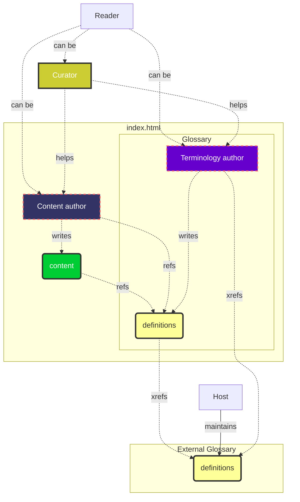

# Introduction

## Intro

**Spec-Up-T** is a tool that helps you write specifications. Specifications in Spec-Up-T have two main parts:
* content 
* term definitions

Content is stored in markdown files under the `spec` directory, Terms definition optionally in various languages and optionally in various user levels are stored in the `terms-definitions` folder also in the spec directory.

The two parts content and term definitions also illustrate the two main use cases of Spec-Up-T both resulting in single-file html servable from any webserver:
- a glossary (fat terms section, slim content section)
- a standardization specification (slim terms section, fat content section)

> An example **glossary** is the [Main TrustoverIP glossary](https://github.com/trustoverip/ctwg-main-glossary)
> An example **standard specification** is the [DID:Webs specification](https://github.com/trustoverip/tswg-did-method-webs-specification)

## Use cases and roles in Spec-Up-T

Spec-Up-T is a technical specification and standardization tool, which a special focus on termninology: definiton and (externally) referencing terms and the version management of this complex.

We have distinguished the following **roles**:
- [terminology-authors](./various-roles/terminology-authors-guide/introduction.md)
- [content-authors](./various-roles/content-authors-guide/introduction.md)
- [curators](./various-roles/curators-guide/introduction.md)
- [readers](./various-roles/readers-guide/introduction.md)

Supporting roles are:
- [admins](./various-roles/admins-guide/introduction.md)
- [developers](./various-roles/developers-guide/intro.md)

### Real-life example KERI team

We have KERI specifications that consist of content and terminology. Let's take the KERI spec as an example. A `reader` could be anyone interested in the spec:
- studying KERI
- contributing to KERI in team
Contributing to any Spec-Up-T-based specification can be of type:
- `curator`
- `content author` or editor
- `terminology author` or editor

Any specifcation has a **content** part and a Terms and **Definitions** section. In real life they appear in the same document. There'll be one chapter called Terms and Definitions, into which Spec-Up-T generates all the term defnitions. All the other chapters (if present) are considered 'content'. For example the chapter "[KERI Foundational Overview](https://trustoverip.github.io/tswg-keri-specification/#keri-foundational-overview)".  
However, through all the chapters, including the Terms and Definitions chapter itself, references to the Terms & Definition may occur and literally pop-up for the `reader`.

> KERI inventor *Samuel Smith* can be a `reader` of the spec, but will most probably quickly turn into a `curator`, `content author`, and `terminology author`.

> *Henk van Cann* has written 90% of all KERI definitions, he's a typical `terminology author`. *Kent Bull* has been a curator for quite a few **definitions** of Henk because of Kent's native tongue and extensive KERI knowledge.

> *Phil Pfeairheller* is a typical user of term defnitions. Generally he is a `content author` of specifications in the KERI team, whenever he sees a term that is not yet defined, he might create a definition on-the-fly if needed.

Note that any specification could use only **definitions** of other glossaries. And xref to those glossaries. This is rather uncommon because if your specifying, you most probably construct new concepts whithin a new mental model.

*Drummond Reed* is `terminology author` of the ToIP main glossary. The main glosary has *hardly any content section*. All other terminology authors and content authors can use the Main ToIP glossary by `xref`-ing to it, as a plain Spec-Up-T link "[[xref: glossary, term ]]" even in their own `def`s to explain the difference between the mental model of the term in the smaller context vs. the broader ToIP context.

So most probably per repo the term **definitions** will be a mixture of:
- full-URL links to external glossaries and resources
- `xref`s to other Spec-Up-T based glossaries
- `ref`s to `def`s present in the own Terms and Definition section
- the `def` section will contain `ref`s and `xref`s too to other terms

The more `xref`s a specification and team is able to use the more consensus is build in the broader community. For example: Henk van Cann will sync all terms that the KERI team uses with the one that IoIP uses in the main ToIP glossary.

### Formal roles and flow

All the **use cases** are specified under the roles above. Click the links to get there.

## Technical presence

It is a tool for writing in Markdown and creates *one* `index.html` file.

- You write your texts in [Markdown](https://www.markdownguide.org/getting-started/)
- You use an editor (IDE) or you use GitHub's web editor
- Your Markdown-files are converted to one `index.html` file
- The place where your Markdown files and the `index.html` are stored is [GitHub](https://github.com)

The endproduct of your work is **the `index.html` file, the actual specification file.**

This `index.html` file is stand-alone and can be hosted on any web server. Or double-click it, and it will open in a browser.

The Spec-Up-T code itself is available [on Github](https://github.com/blockchainbird/spec-up-t).

## Spec-Up and Spec-Up-T

Spec-Up-T is based on **Spec-Up**, and some of the content on this website is taken from the [Spec-Up website](https://identity.foundation/spec-up/) and [repo](https://github.com/decentralized-identity/spec-up).

:::tip

If you aren't contributing to an existing Spec-Up-T project and want to create one yourself, you will have to install Spec-Up-T to start using it. Go straight to the [installation section](general/installation.md) for instructions. If you are contributing to an existing Spec-Up-T project you can contribute to content directly within GitHub's web editor (for example) by editing and adding the appropriate markdown files.

:::
