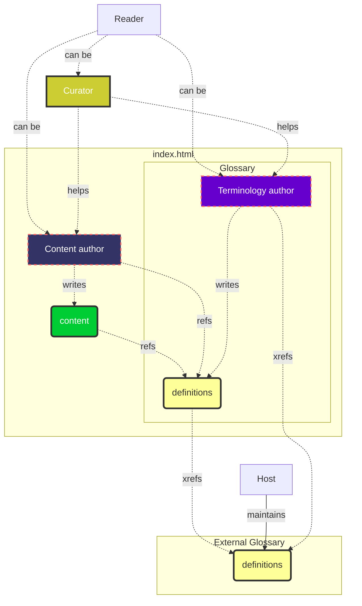

# Real-life example

## The KERI team

We have KERI specifications that consist of content and terminology. Let's take the KERI spec as an example. A `reader` could be anyone interested in the spec:
- studying KERI
- contributing to KERI in team

Contributing to any Spec-Up-T-based specification can be of type:
- `curator`
- `content author` or editor
- `terminology author` or editor

Any specifcation has a **content** part and a Terms and **Definitions** section. In real life they appear in the same document. There'll be one chapter called Terms and Definitions, into which Spec-Up-T generates all the term defnitions. All the other chapters (if present) are considered 'content'. For example the chapter "[KERI Foundational Overview](https://trustoverip.github.io/tswg-keri-specification/#keri-foundational-overview)".  
However, through all the chapters, including the Terms and Definitions chapter itself, references to the Terms & Definition may occur and literally pop-up for the `reader`.

> KERI inventor *Samuel Smith* can be a `reader` of the spec, but will most probably quickly turn into a `curator`, `content author`, and `terminology author`.

> *Henk van Cann* has written 90% of all KERI definitions, he's a typical `terminology author`. *Kent Bull* has been a curator for quite a few **definitions** of Henk because of Kent's native tongue and extensive KERI knowledge.

> *Phil Pfeairheller* is a typical user of term defnitions. Generally he is a `content author` of specifications in the KERI team, whenever he sees a term that is not yet defined, he might create a definition on-the-fly if needed.

Note that any specification could use only **definitions** of other glossaries. And `xref` to those glossaries. This is rather uncommon because if your specifying, you most probably construct new concepts whithin a new mental model.

*Drummond Reed* is `terminology author` of the ToIP main glossary. The main glosary has *hardly any content section*. All other terminology authors and content authors can use the Main ToIP glossary by `xref`-ing to it, as a plain Spec-Up-T link "[[xref: glossary, term ]]" even in their own `def`s to explain the difference between the mental model of the term in the smaller context vs. the broader ToIP context.

So most probably per repo the term **definitions** will be a mixture of:
- full-URL links to external glossaries and resources
- `xref`s to other Spec-Up-T based glossaries
- `ref`s to `def`s present in the own Terms and Definition section
- the `def` section will contain `ref`s and `xref`s too to other terms

The more `xref`s a specification and team is able to use the more consensus is build in the broader community. For example: Henk van Cann will sync all terms that the KERI team uses with the one that IoIP uses in the main ToIP glossary.

## Formal roles and flow

All the **use cases** are specified under the roles above. Click the links to get there.
